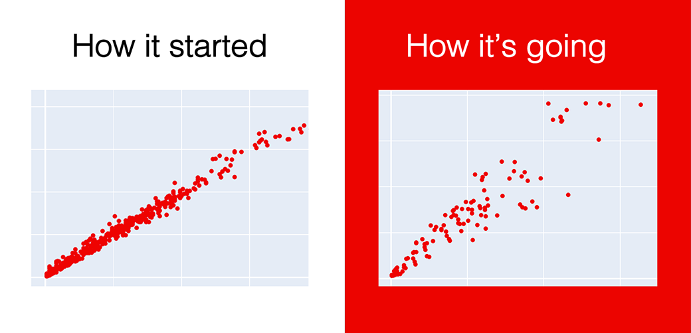

# Monitor production models

**TL;DR:** You can use Evidently for report-based monitoring of your production models. Here is an example [Jupyter notebook](https://github.com/evidentlyai/evidently/blob/main/evidently/tutorials/bicycle\_demand\_monitoring\_tutorial.ipynb) for bike demand forecasting case.

## Tutorial - "How to break a model in 20 days".

In this tutorial, we train a **demand prediction** model, simulate the production use, and analyze its gradual decay. The tutorial uses the **Data Drift**, **Numerical Target Drift,** and **Regression Performance** reports.

* [Full text](https://evidentlyai.com/blog/tutorial-1-model-analytics-in-production) of the tutorial in Evidently blog
* Jupyter [notebook](https://github.com/evidentlyai/evidently/blob/main/evidently/tutorials/bicycle\_demand\_monitoring\_tutorial.ipynb) w/source code
* Source [data](https://archive.ics.uci.edu/ml/machine-learning-databases/00275/) and dataset [description](https://archive.ics.uci.edu/ml/datasets/bike+sharing+dataset#) on UCI repository&#x20;
