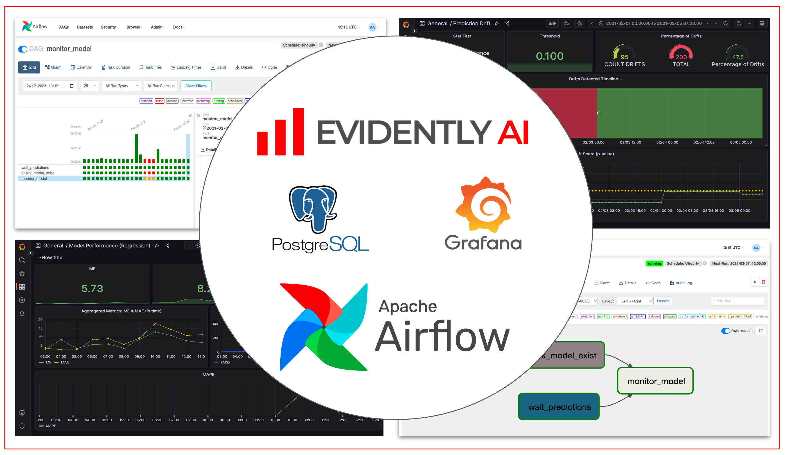

# Data and Target Drift Detection for Production Pipelines using Evidently, Airflow and Grafana
This example shows steps to integrate Evidently into your production pipeline using `Airflow`, `PostgreSQL`, and `Grafana`.

- Run production ML pipelines for inference and monitoring with [Airflow](https://airflow.apache.org/). 
- Generate data quality and model monitoring reports with `EvidenltyAI`
- Save monitoring metrics to [PostgreSQL](https://www.postgresql.org/) database 
- Visualize ML monitoring dashboards in [Grafana](https://grafana.com/) 



--------
Project Organization
------------
    .
    ├── airflow            <- Airflow configs
    ├── dags               <- Airflow DAGs
    │
    ├── data
    │   ├── features       <- Features for model training and inference.
    │   ├── predictions    <- Generated predictions.
    │   ├── raw            <- The original, immutable data dump.
    │   └── reference      <- Reference datasets for monitoring.
    │
    ├── docker             <- Dockerfiles
    ├── grafana            <- Configs for Grafana dashboards
    ├── models             <- Trained and serialized models
    │
    ├── reports            <- Monitoring reports
    │   ├── data_drift     
    │   ├── prediction_drift
    │   └── target_drift
    │
    ├── src                <- Source code for use in this project.
    │   ├── monitoring     <- Common code for monitoring 
    │   ├── pipelines      <- Source code for all pipelines
    │   ├── scripts        <- Helper scripts
    │   ├── utils          <- Utility functions and classes 
    │ 
    └── static             <- Assets for docs 
    

## :woman_technologist: Installation

### 1 - Fork / Clone this repository

Get the tutorial example code:

```bash
git clone git@github.com:evidentlyai/evidently.git
cd evidently/examples/integrations/airflow_drift_detection
```

### 2 - Build a base Docker image
```bash
export AIRFLOW_UID=$(id -u)
docker build \
  -t airflow-base-2.6.2 \
  --build-arg AIRFLOW_UID=${AIRFLOW_UID} \
  -f docker/airflow_base/Dockerfile \
  .
```

## :rocket: Launch Monitoring Cluster

### 1 - Launch a cluster 

```bash
export AIRFLOW_UID=$(id -u)
export PROJECT_DIR=${PWD}
docker compose up -d
```


<details>
<summary> Details on the cluster components </summary>

- `airflow-webserver` - Airflow UI, available on [http://localhost:8080](http://localhost:8080)
- `airflow-scheduler` - Airflow Scheduler (doesn't hae exposed endpoints)
- `airflow-db` - Airflow PostgreSQL DataBase, available on [http://localhost:5432](http://localhost:5432)
- `monitoring-db` - `PostgreSQL`, available on [http://localhost:5433](http://localhost:5432)
- `grafana` - `Grafana` dashboards, available on [http://localhost:3000](http://localhost:3000)

</details>

Please note that `$PROJECT_DIR` refers to the path of the `evidently_airflow` example directory on your local machine. The above command mounts the example code to the identical path inside the `airflow-webserver` container. This step streamlines access to the code, data, and artifacts within the container. For example,

- if the example code is located in the `/Users/.../evidently_airflow` directory on a Mac,
- it will be mounted to the identical `/Users/.../evidently_airflow` path within the container.


### 2 - Create monitoring DB structure

Create tables for monitoring metrics. 

```bash

# Enter container of airflow-webserver
docker exec -ti airflow-webserver /bin/bash

# Create tables for monitoring metrics (inside airflow-webserver)
cd $PROJECT_DIR/
python src/scripts/create_db.py
```

<details>
<summary>Notes</summary>
  
- tables are described in [src/utils/models.py](src/utils/models.py)
- if you want drop all tables (in case of error or to clear database) and recreate them do:
  
```bash
# Drop all tables
python src/scripts/drop_db.py
# Create all tables
python src/scripts/create_db.py
```

</details>


### 3 - Set up Airflow variables and connections

To use the [FileSensor](https://airflow.apache.org/docs/apache-airflow/stable/howto/operator/file.html) to detect files required by DAGs, you need to have connection defined to use it (pass connection id via `fs_conn_id`). Default connection is `fs_default`

```bash 

# Enter container of airflow-webserver
docker exec -ti airflow-webserver /bin/bash
              
# Add a `fs_default` connection 
airflow connections add fs_default --conn-type fs

``` 


### 4 - Download data & train model

This is a preparation step. This examples requires some data and a trained model.

```bash 
cd $PROJECT_DIR/

python src/pipelines/load_data.py               # Download data for NYC Taxi to 'data/raw'
python src/pipelines/process_data.py            # Process & save to 'data/features/'
python src/pipelines/train.py                   # Save trained model to 'models/' 
python src/pipelines/prepare_reference_data.py  # Save to 'data/reference'
```

### 5 - Open Monitoring Dashboards (Grafana)

##### Enter Airflow UI and run DAGs: [http://localhost:8080](http://localhost:8080)

<details>
<summary>Credentials</summary>

- *login*: `admin`
- *password*: `admin`

</details>


##### Enter Grafana UI and open Monitoring Dashboards: [http://localhost:3000](http://localhost:3000)

<details>
<summary>Credentials</summary>

- *login*: `admin`
- *password*: `admin`

</details>


## :checkered_flag: Stop cluster

```bash
docker compose down
```

<details>
<summary>Notes</summary>

- To clear cluster one needs to remove `Docker` volumes containing `Airflow`, monitoring (`Postegres`) and `Grafana` databases 
- It may be useful to run this tutorial from scratch
- Run the command:
  
```bash
docker compose down -v --remove-orphans
```

</details>

## :tv: Develop and Debug Monitoring Pipelines
- In case you want to develop, run or debug Pipelines in Python Virtual Environment
- Create virtual environment named `.venv` and install python libraries

### 1 - Create Python Virtual Environment
  
```bash
python3 -m venv .venv
echo "export PYTHONPATH=$PWD" >> .venv/bin/activate
source .venv/bin/activate
pip install --upgrade pip setuptools wheel
pip install -r requirements.txt
```
</details>


### 2 - Set up Environment Variables 
For debug purpose, you can run monitoring pipelines, in local environment. 
To make Just set MONITORING_DB_HOST variable to `localhost`: `export MONITORING_DB_URI='localhost'` 
```bash 
export MONITORING_DB_HOST="localhost"
```


### 3 - Run monitoring pipelines

```bash
python src/pipelines/monitor_data.py --ts '2021-02-01 01:00:00' --interval 60
python src/pipelines/predict.py --ts '2021-02-01 01:00:00' --interval 60
python src/pipelines/monitor_prediction.py --ts '2021-02-01 01:00:00' --interval 60
python src/pipelines/monitor_model.py --ts '2021-02-01 02:00:00' --interval 60
```

<details>
<summary>Notes</summary>

-  It's expected to run the `predict` pipeline before monitoring pipelines for each timestamp `--ts` 
- `monitor_model` pipeline requires ground truth data to test the quality of predictions. We assume that these labels are available for the previous period. The earliest date to run `monitor_model` is '2021-02-01 02:00:00'

</details>
