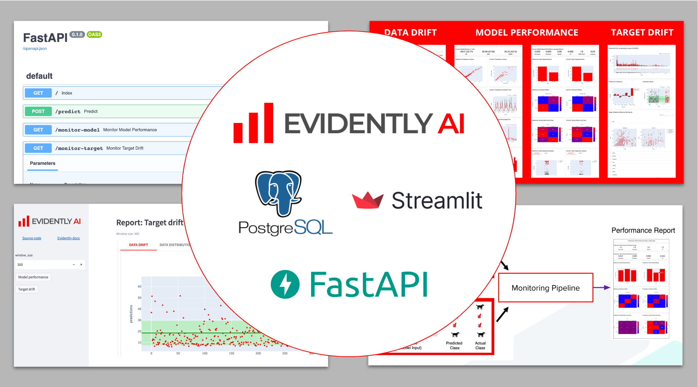

# Enhanced Machine Learning Model Monitoring with FastAPI and Evidently AI: A Step-By-Step Guide



This example shows steps to integrate Evidently into your production pipeline using FastAPI and PostgreSQL.

- Run production ML pipelines for inference and monitoring with [FastAPI](https://fastapi.tiangolo.com/). 
- Generate data quality and model monitoring reports with EvidenltyAI
- Save predictions to [PostgreSQL](https://www.postgresql.org/) database
- View monitoring reports using API endpoints or [Streamlit](https://streamlit.io/) UI 


--------
Project Organization
------------

    ├── README.md          <- The top-level README for developers using this project.
    ├── config             <- Configs directory
    ├── data
    │   ├── features       <- Features for model training and inference.
    │   ├── raw            <- The original, immutable data dump.
    │   └── reference      <- Reference datasets for monitoring.
    ├── fastapi            <- FastAPI application
    ├── models             <- Trained and serialized models, model predictions, or model summaries
    ├── reports             <- Monitoring report files
    │
    ├── src                <- Source code for use in this project.
    │   ├── monitoring     <- Common code for monitoring 
    │   │
    │   ├── pipelines      <- Source code for all pipelines
    │   │
    │   ├── scripts        <- Helper scripts
    │   │
    │   ├── utils          <- Utility functions and classes 
    ├── static             <- Assets for docs 
    └── streamlit_app      <- Streamlit application
     


--------

## :woman_technologist: Installation

### 1. Fork / Clone this repository

Get the tutorial example code:

```bash
git clone git@github.com:evidentlyai/evidently.git
cd evidently/examples/integrations/fastapi_monitoring
```


### 2. Build Docker images

```bash
export USER_ID=$(id -u)
docker compose build
```

<details>
<summary>For debugging purposes, create DEV environment</summary>

**Note:** 
- This example requires Python 3.9 or above 

Build virtual environment:

```bash
python3 -m venv .venv
echo "export PYTHONPATH=$PWD" >> .venv/bin/activate
source .venv/bin/activate
pip install --upgrade pip setuptools wheel
pip install -r requirements-dev.txt
```

For Linux:

```bash 
sudo apt install libpq-dev 
pip install psycopg2==2.9.5
```

For MacOS: 

```bash 
pip install psycopg2-binary==2.9.5
```

</details>


## :rocket: Launch Monitoring Cluster

### 1 - Launch a cluster 

```bash
docker compose up -d
```

<details>
<summary>The cluster components are specified in the `docker-compose.yaml`</summary>

- `streamlit_app` - Streamlit application, available on [http://localhost:8501](http://localhost:8501)
- `fastapi` - FastAPI application, available on [http://localhost:5000](http://localhost:5000)
- `monitoring-db` - PostgreSQL, available on [http://localhost:5432](http://localhost:5432)

</details>


### 2 - Enter working Docker container

```bash
docker exec -ti fastapi_app /bin/bash
```

**Note**: further commands will be run inside the `Docker` container.


### 3 - Create monitoring DB structure

Create tables to store predictions 

```bash
python src/scripts/create_db.py
```

<details>
<summary>Notes</summary>
  
- tables are described in [src/utils/models.py](src/utils/models.py)
- if you want drop all tables (in case of error or to clear database) and recreate them do:
  
```bash
# Drop all tables
python src/scripts/drop_db.py
# Create all tables
python src/scripts/create_db.py
```

</details>


### 4 - Download data & train model

This is a preparation step. This examples requires some data and a trained model.

```bash 
python src/pipelines/load_data.py               # Download data for NYC Taxi to 'data/raw'
python src/pipelines/process_data.py            # Process & save to 'data/features/'
python src/pipelines/train.py                   # Save trained model to 'models/' 
python src/pipelines/prepare_reference_data.py  # Save to 'data/reference'
```

## :tv: Pipelines and Monitoring dashboards


### 1 - Generate predictions


We prepared a script to generate predictions for the model. The scripts simulate a requests to the model and save predictions to PostgreSQL database.

```bash 
python src/scripts/simulate.py > simulation.log 2>&1
```

**Note**:
- `> simulation.log` means that all simulation script logs will be wrote in the file `simulation.log`
- `2>&1` means that ***all*** logs (including errors and non-stdout logs) will be redirect to `simulation.log`

### 2 - Monitoring reports

To generate and view monitoring reports open following endpoints:
- *model performance*: http://0.0.0.0:5000/monitor-model
- *target drift*: http://0.0.0.0:5000/monitor-target

<details><summary>Notes</summary>

- you can build report on different size of prediction data using parameter *`window_size`*, for instance:
    - http://0.0.0.0:5000/monitor-model?window_size=300
    - http://0.0.0.0:5000/monitor-target?window_size=100
- default value of *`window_size`* is *3000*

</details>

### 3 - Preview monitoring reports via Streamlit UI (optional)

Streamlit application implements convenient interface to build and render monitoring reports.

To render report:
- open [Streamlit application](http://localhost:8501)
- input required window size (options; 3000 by default)
- click on of two buttons (***Model performance*** or ***Target drift***) and wait report rendering


## :checkered_flag: Stop cluster

```bash
docker compose down
```

<details>
<summary>Notes</summary>

- To clear cluster one needs to remove `Docker` volume containing monitoring (`Postgres`) database
- It may be useful to run this tutorial from scratch
- Run the command:
  
```bash
docker compose down -v
```

</details>
