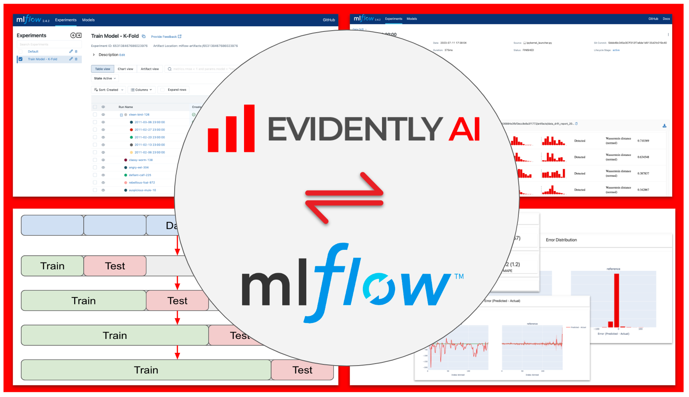

# Enhanced Machine Learning Model Monitoring with MLFlow and Evidently AI

This example shows steps to integrate Evidently and [MLFlow](https://mlflow.org/) into your ML prototypes and production pipelines.



--------
Project Organization
------------

    ├── README.md          <- The top-level README for developers using this project.
    ├── config             <- Configs directory
    ├── data
    │   ├── features       <- Features for model training and inference.
    │   ├── raw            <- The original, immutable data dump.
    │   └── reference      <- Reference datasets for monitoring.
    ├── fastapi            <- FastAPI application
    ├── models             <- Trained and serialized models, model predictions, or model summaries
    ├── reports             <- Monitoring report files
    │
    ├── src                <- Source code for use in this project.
    │   ├── monitoring     <- Common code for monitoring 
    │   │
    │   ├── pipelines      <- Source code for all pipelines
    │   │
    │   ├── scripts        <- Helper scripts
    │   │
    │   ├── utils          <- Utility functions and classes 
    ├── static             <- Assets for docs 
    └── streamlit_app      <- Streamlit application
     


--------

## :woman_technologist: Installation

### 1. Fork / Clone this repository

Get the tutorial example code:

```bash
git clone git@github.com:evidentlyai/evidently.git
cd evidently/examples/integrations/mlflow_integration
```


### 2. Create a virtual environment

- This example requires Python 3.9 or above 

```bash
python3 -m venv .venv
echo "export PYTHONPATH=$PWD" >> .venv/bin/activate
source .venv/bin/activate
pip install --upgrade pip setuptools wheel
pip install -r requirements.txt
```


### 3 - Download data

This is a preparation step. Load data from [https://archive.ics.uci.edu/ml/datasets/bike+sharing+dataset](https://archive.ics.uci.edu/ml/datasets/bike+sharing+dataset) to the `data/` directory

```bash 
python src/pipelines/load_data.py              
```

## :checkered_flag: View experiments and monitoring reports in MLflow UI
Run MLflow before monitoring examples.
```bash
mlflow ui
``` 
And then navigate to [http://localhost:5000](http://localhost:5000) in your browser

## :tv: Monitoring Examples

| No. | Monitoring Example | Description |
|---|---|---|
| 1. | **train-model.ipynb** | Get started with Metrics Tracking for ML Experiments |
| 2. | **train-model-kfold.ipynb** | Production model training with K-Folds cross-validation |
| 3. | **data-drift.ipynb**| Evaluate Data Drift for train/test datasets |
| 4. | **test-model.ipynb** | Test Suites and Reports for Model Training |
| 5. | **monitor-model.ipynb**| Model Monitoring with Evidently and MLFlow |


## Acknowledgments

The dataset used in the example is downloaded from: https://www.kaggle.com/c/bike-sharing-demand/data?select=train.csv
- Fanaee-T, Hadi, and Gama, Joao, 'Event labeling combining ensemble detectors and background knowledge', Progress in Artificial Intelligence (2013): pp. 1-15, Springer Berlin Heidelberg
- More information about the dataset can be found in UCI machine learning repository: https://archive.ics.uci.edu/ml/datasets/bike+sharing+dataset