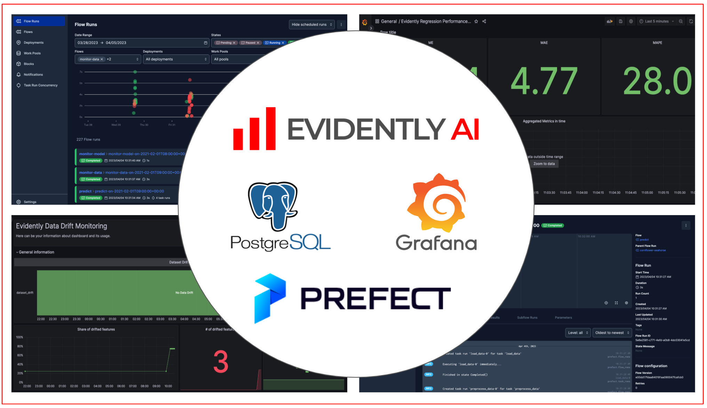

# Enhanced ML Monitoring for Production Pipelines using Prefect, PostgreSQL, and Grafana
This example shows steps to integrate Evidently into your production pipeline using Prefect, PostgreSQL, and Grafana.

- Run production ML pipelines for inference and monitoring with [Prefect](https://www.prefect.io/). 
- Generate data quality and model monitoring reports with EvidenltyAI
- Save monitoring metrics to [PostgreSQL](https://www.postgresql.org/) database 
- Visualize ML monitoring dashboards in [Grafana](https://grafana.com/) 



--------
Project Organization
------------

    ├── README.md          <- The top-level README for developers using this project.
    ├── data
    │   ├── features       <- Features for model training and inference.
    │   ├── predictions    <- Generated predictions.
    │   ├── raw            <- The original, immutable data dump.
    │   └── reference      <- Reference datasets for monitoring.
    │
    ├── grafana            <- Configs for Grafana dashboards
    │
    ├── models             <- Trained and serialized models, model predictions, or model summaries
    │
    ├── prefect            <- Prefect artifacts and DB
    │
    ├── src                <- Source code for use in this project.
    │   ├── monitoring     <- Common code for monitoring 
    │   │
    │   ├── pipelines      <- Source code for all pipelines
    │   │
    │   ├── scripts        <- Helper scripts
    │   │
    │   ├── utils          <- Utility functions and classes 
    │
    └── static             <- Assets for docs 


--------

## :woman_technologist: Installation

### 1. Fork / Clone this repository

Get the tutorial example code:

```bash
git clone git@github.com:evidentlyai/evidently.git
cd evidently/examples/integrations/postgres_grafana_batch_monitoring
```

### 2. Create virtual environment

Create virtual environment named `.venv` and install python libraries

```bash
python3 -m venv .venv
echo "export PYTHONPATH=$PWD" >> .venv/bin/activate
source .venv/bin/activate
pip install --upgrade pip setuptools wheel
pip install -r requirements.txt
```

## :rocket: Launch Monitoring Cluster

### 1 - Launch a cluster 

```bash
docker compose up -d
```

<details>
<summary>The cluster components are specified in the `docker-compose.yaml`</summary>

- `prefect` - Prefect UI, available on [http://localhost:4200](http://localhost:4200)
- `monitoring-db` - PostgreSQL, available on [http://localhost:5432](http://localhost:5432)
- `grafana` - Grafana Dashboards, available on [http://localhost:3000](http://localhost:3000)

</details>


### 2 - Create monitoring DB structure

Create tables for monitoring metrics. 

```bash
python src/scripts/create_db.py
```

<details>
<summary>Notes</summary>
  
- tables are described in [src/utils/models.py](src/utils/models.py)
- if you want drop all tables (in case of error or to clear database) and recreate them do:
  
```bash
# Drop all tables
python src/scripts/drop_db.py
# Create all tables
python src/scripts/create_db.py
```

</details>


## :arrow_forward: Download data & train model

This is a preparation step. This examples requires some data and a trained model.

```bash 
python src/pipelines/load_data.py               # Download data for NYC Taxi to 'data/raw'
python src/pipelines/process_data.py            # Process & save to 'data/features/'
python src/pipelines/train.py                   # Save trained model to 'models/' 
python src/pipelines/prepare_reference_data.py  # Save to 'data/reference'
```

## :tv: Pipelines and Monitoring dashboards

### 1 - Configure `Prefect` API URL

```bash
export PREFECT_API_URL=http://localhost:4200/api
```

### 2 - Run scheduled inference & monitoring pipelines

```bash 
python src/pipelines/scheduler.py          
```

Or, run each pipeline (flow) separately: 

```bash
python src/pipelines/predict.py --ts '2021-02-01 01:00:00' --interval 60
python src/pipelines/monitor_data.py --ts '2021-02-01 01:00:00' --interval 60
python src/pipelines/monitor_model.py --ts '2021-02-01 02:00:00' --interval 60

```

<details>
<summary>Notes</summary>

-  It's expected to run the `predict` pipeline before monitoring pipelines for each timestamp `--ts` 
- `monitor_model` pipeline requires ground truth data to test the quality of predictions. We assume that these labels are available for the previous period. The earliest date to run `monitor_model` is '2021-02-01 02:00:00'

</details>

### 3 - Open Prefect UI

Enter Prefect UI: ```http://localhost:4200```

### 4 - Open Monitoring Dashboards (Grafana)

Enter Grafana UI: ```http://localhost:3000```

<details>
<summary>Credentials</summary>

- *login*: `admin`
- *password*: `admin`

</details>


## :checkered_flag: Stop cluster

```bash
docker compose down
```

<details>
<summary>Notes</summary>

- To clear cluster one needs to remove `Docker` volumes containing monitoring (`Postegres`) and `Grafana` databases 
- It may be useful to run this tutorial from scratch
- Run the command:
  
```bash
docker compose down -v
```

</details>
