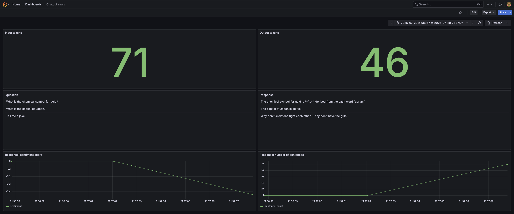

# Monitoring example

## Prerequisites

You need following tools installed:
- `docker`
- `docker-compose` (included to Docker Desktop for Mac and Docker Desktop for Windows )

## Preparation

Note: all actions expected to be executed in repo folder.

- Create virtual environment and activate it (eg. `python -m venv venv && source ./venv/bin/activate` or `conda create -n venv python=3.11 && conda activate venv`)
- Install required packages `pip install -r requirements.txt`
- Run `baseline_model_nyc_taxi_data.ipynb` for downloading datasets, training model and creating reference dataset 

## Monitoring Example


### Starting services

To start all required services, execute:
```bash
docker-compose up
```

It will start following services:
- `db` - PostgreSQL, for storing metrics data
- `adminer` - database management tool
- `grafana` - Visual dashboarding tool 


### Sending data

To calculate Evidently metrics and send them to the database:

1. If you **don’t have** the `OPENAI_API_KEY` set as an environment variable:
   - Open `evidently_metrics_calculation.py`
   - Manually set your API key in the OpenAI client configuration
   - Save the file

2. Then run the script:

```bash
python evidently_metrics_calculation.py
```

This script will simulate batch monitoring. Every 10 seconds it will collect data for a daily batch, calculate metrics and insert them into database. This metrics will be available in Grafana in preconfigured dashboard. 

### Accsess dashboard

- In your browser go to a `localhost:3000`
The default username and password are `admin`

- Then navigate to `General/Home` menu and click on `Home`.

- In the folder `General` you will see `New Dashboard`. Click on it to access preconfigured dashboard.

### Stopping services

To stop all services, execute:
```bash
docker-compose down
```
